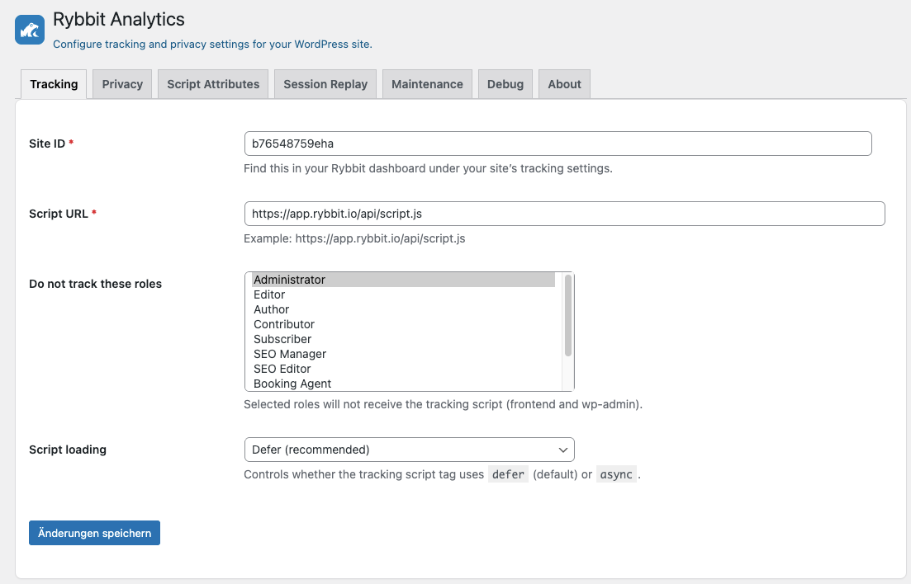

# Integrate Rybbit

WordPress Plugin to add and manage the Rybbit tracking script on your sites.
Rybbit is a privacy-focused and GDPR-compliant web analytics platform.

## Requirements

- WordPress 5.8 or newer
- PHP 7.4 or newer

## Installation

1. Download the plugin zip file from the [latest release](https://github.com/maki-it/rybbit-wordpress-plugin/releases/latest).
2. Log in to your WordPress admin dashboard.
3. Navigate to `Plugins` > `Add New`.
4. Click on the `Upload Plugin` button at the top of the page.
5. Choose the downloaded zip file and click `Install Now`.
6. After installation, click `Activate Plugin`.

## Configuration
1. Go to `Settings` > `Integrate Rybbit`
2. Enter your Rybbit Site ID and optionally the url to your own Rybbit instance.
3. Save the changes.

# Screenshot

# Legal

This is a free and open-source WordPress plugin developed independently for integration with Rybbit 
and licensed under the GNU General Public License v3 or later.

The use of the Rybbit name and logo in this plugin has been explicitly approved by the owner of Rybbit.
All Rybbit trademarks, logos, and brand assets remain the property of their respective owner.

This plugin is not an official Rybbit product and is not otherwise affiliated with or endorsed by Rybbit.
